Train Ticketing Application

A Java Spring Boot REST API for train ticket booking, route management, and delay notifications.

---

## Tech Stack

- **Java 17** + **Spring Boot 3.2**
- **Spring Security** + **JWT** authentication
- **MySQL** + **Flyway** migrations
- **Spring Data JPA** (Hibernate)
- **Spring Mail** for email notifications
- **Springdoc OpenAPI** (Swagger UI)

---

### Prerequisites + Environmental Variables
- Java 17+
- MySQL 8+
- Maven or Gradle

DB_USERNAME=your_mysql_user
DB_PASSWORD=your_mysql_password
MAIL_USERNAME=your_email@gmail.com
MAIL_PASSWORD=your_app_password
JWT_SECRET=your_secret_key
JWT_EXPIRATION=86400

### Swagger UI
```
http://localhost:8080/swagger-ui/index.html
```

---

## API Usage Examples

### 1. Login as Administrator

Authenticate with admin credentials to receive a JWT token. Use this token as `Bearer <token>` in the `Authorization` header for all the following requests.

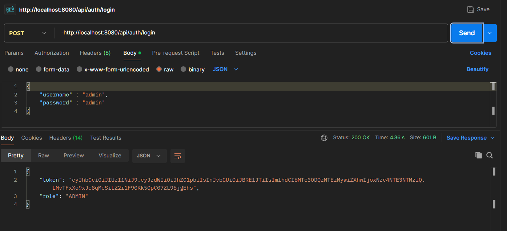

---

### 2. Add Stations

Create train stations that will be used as stops for the upcoming routes

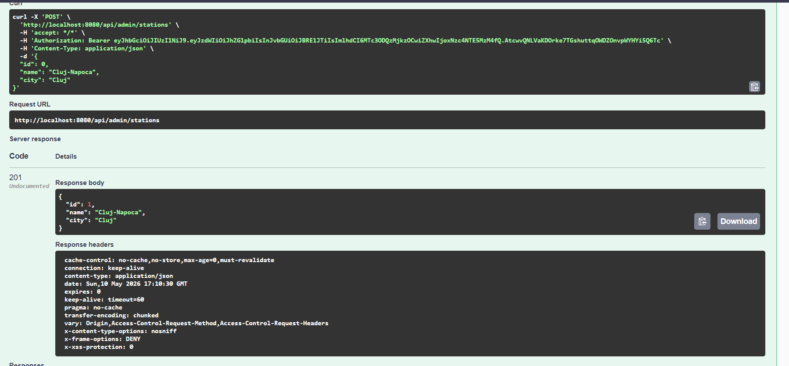

---

### 3. Delete a Station

Remove an existing station by ID.

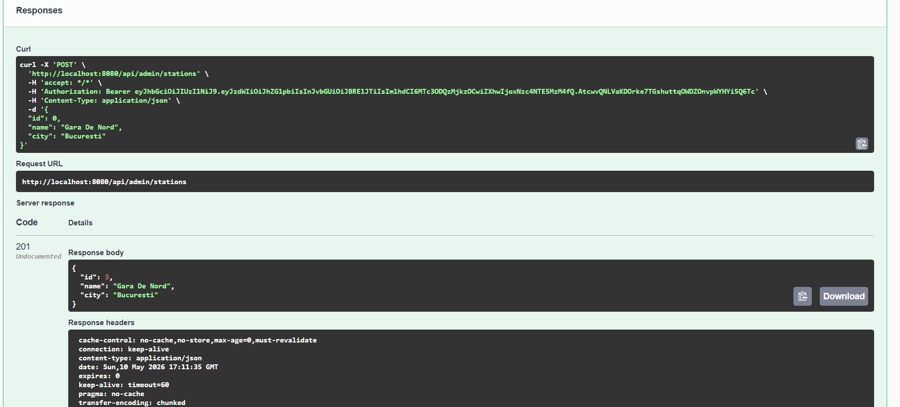

---

### 4. Add Train Schedule

Create a schedule for a train, with mentioning in which days it will travel.

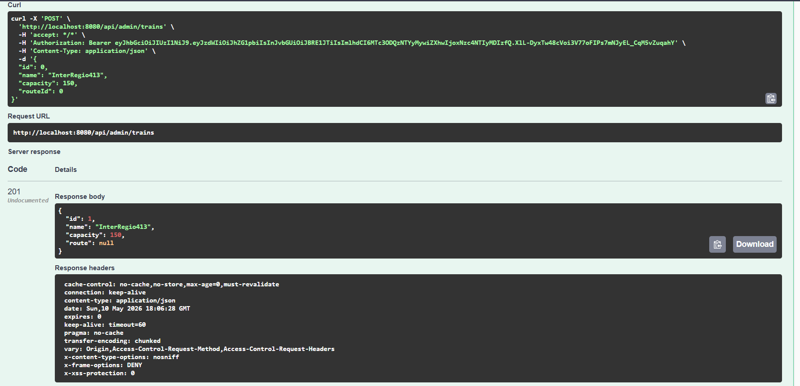

---

### 5. Add Route

Create a named route that trains will follow.

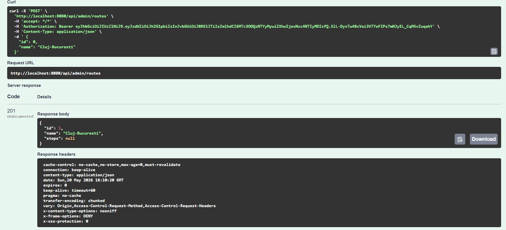

---

### 6. Add Route Stops

Add stations to a route in order, with expected arrival times at each stop.

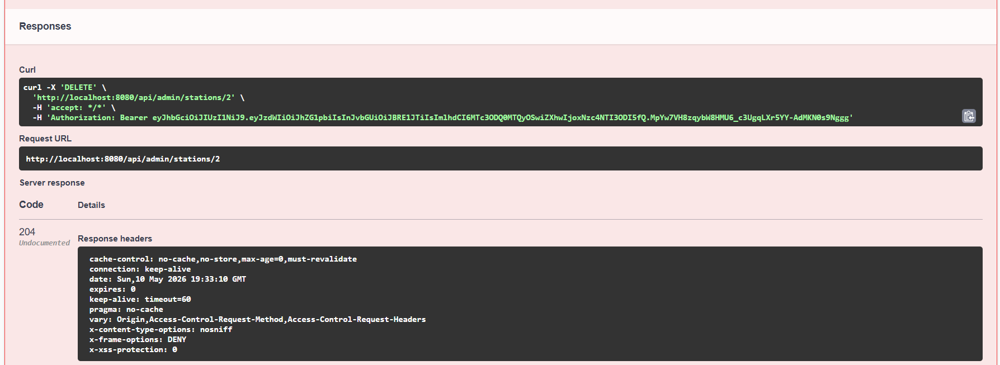

---

### 7. Create a Booking

Book one or more seats on a train if there are enough seats available . A confirmation email is automatically sent to the customer's email address.

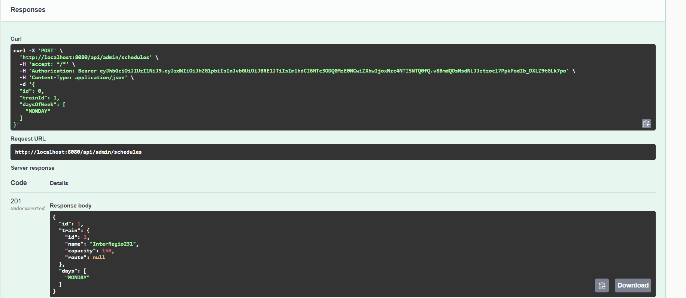
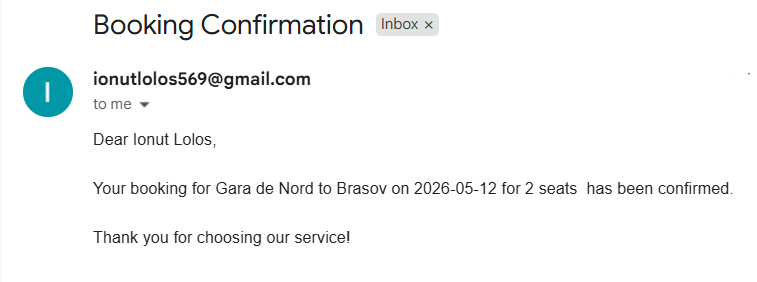

---

### 8. Overbooking Prevention

If the requested number of seats exceeds the train's available capacity, the booking is rejected with a `409 Conflict` response.

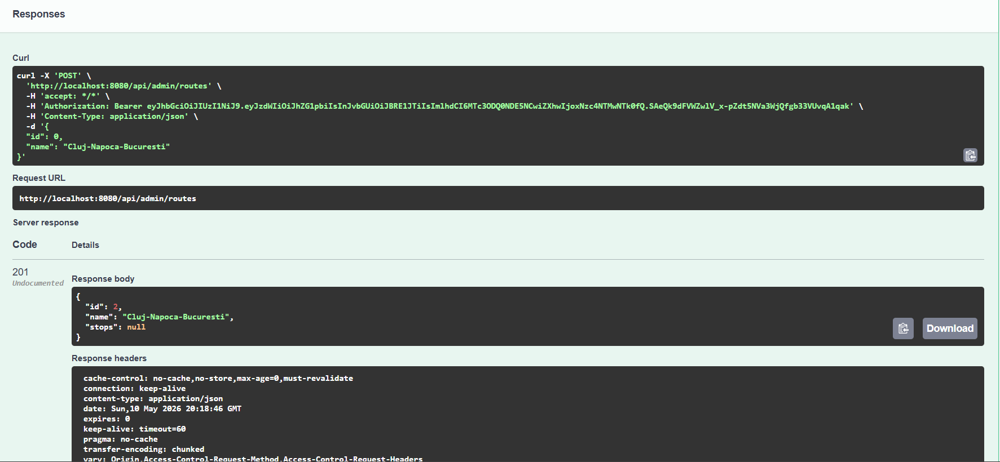

---

### 9. Report a Delay

Administrators can set the actual arrival time at a station. If it is later than the expected time, all affected customers are automatically notified via email.

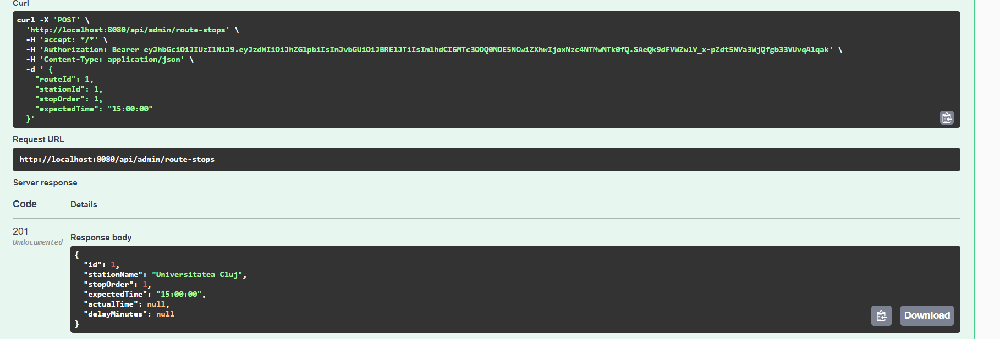
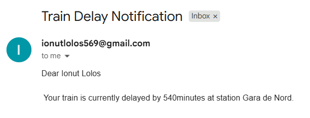

---

### 10. Search with Changeover

Find journeys between two stations. The system handles both direct routes and routes requiring a changeover between trains. If no route exists, an appropriate error message is returned.

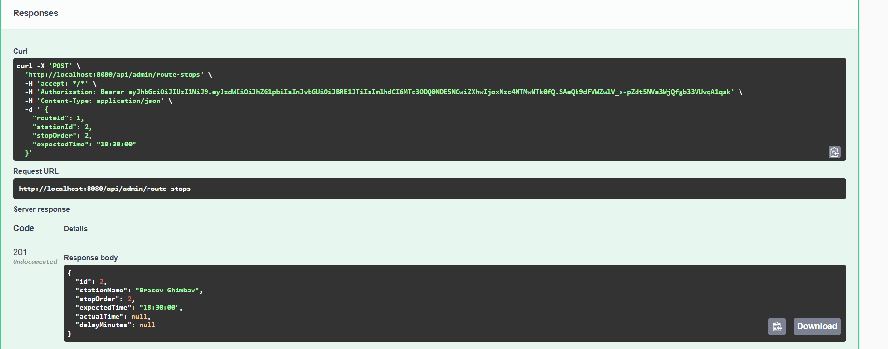

---

## Project Structure

```
src/main/java/org/example/
├── admin/          # Admin controller and service
├── auth/           # JWT authentication, security config
├── booking/        # Booking entity, service, controller
├── infrastructure/ # Email service, shared exceptions
├── route/          # Route entity, repository
├── routestop/      # RouteStop entity, repository
├── schedule/       # Schedule entity, repository
├── search/         # Journey search service and controller
├── station/        # Station entity, service
└── train/          # Train entity, service, controller
```

---

## Database Schema

```
stations
routes
route_stops  ──→ routes, stations
trains       ──→ routes
schedules    ──→ trains
schedule_days ──→ schedules
bookings     ──→ schedules
users
```

---

